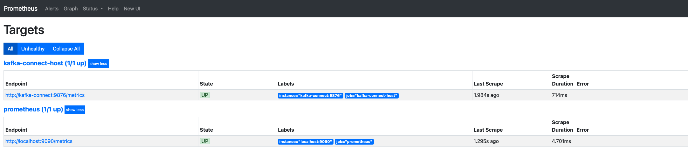

# Инструкция по работе с Kafka-кластером в Docker

## Оглавление
- [Используемые параметры конфигурации](#используемые-параметры-конфигурации)
- [Как проверить работу Kafka через Kafka UI](#как-проверить-работу-kafka-через-kafka-ui)
- [Проверка практической работы №2](#проверка-практической-работы-2)
- [Проверка практической работы №3](#проверка-практической-работы-3)
- [Проверка практической работы №4](#проверка-практической-работы-4)
- [Проверка доп. задания](#проверка-доп-задания)
- [Проверка практической работы №5](#проверка-практической-работы-5)
- [Проверка практической работы №6](#проверка-практической-работы-6)
- [Проверка практической работы №7](#проверка-практической-работы-7)
- [Проверка финального проекта](#проверка-финального-проекта-аналитическая-платформа-для-маркетплейса)

## Используемые параметры конфигурации:

### KAFKA-KRAFT

| Параметр                             | Значение                                        | Описание                                                                                                                      |
|------------------------------------|------------------------------------------------|-------------------------------------------------------------------------------------------------------------------------------|
| `KAFKA_SCHEMA_REGISTRY_URL`        | `schema-registry:8081`                          | URL сервиса Schema Registry для управления схемами сериализации сообщений Kafka.                                              |
| `KAFKA_ENABLE_KRAFT`               | `yes`                                          | Включение режима KRaft (Kafka Raft Metadata mode) — режима работы Kafka без ZooKeeper.                                        |
| `KAFKA_CFG_ALLOW_PLAINTEXT_LISTENER` | `yes`                                       | Разрешает прослушивание подключений без шифрования (plaintext).                                                               |
| `KAFKA_CFG_PROCESS_ROLES`          | `broker,controller`                             | Роли, которые выполняет данный узел: брокер и контроллер.                                                                      |
| `KAFKA_KRAFT_CLUSTER_ID`           | `abcdefghijklmnopqrstuv`                        | Уникальный идентификатор кластера KRaft.                                                                                      |
| `KAFKA_CFG_LISTENERS`              | `PLAINTEXT://0.0.0.0:9092,EXTERNAL://0.0.0.0:9094,CONTROLLER://0.0.0.0:9093` | Адреса и порты, на которых Kafka слушает входящие соединения по разным протоколам (PLAINTEXT — основной брокер, EXTERNAL — внешний, CONTROLLER — внутренний контроллер). |
| `KAFKA_CFG_LISTENER_SECURITY_PROTOCOL_MAP` | `CONTROLLER:PLAINTEXT,PLAINTEXT:PLAINTEXT,EXTERNAL:PLAINTEXT` | Соответствие между именами слушателей и используемыми протоколами безопасности.                                               |
| `KAFKA_CFG_NODE_ID`                | `0`                                            | Уникальный идентификатор узла Kafka в кластере.                                                                               |
| `KAFKA_CFG_CONTROLLER_QUORUM_VOTERS` | `0@kafka-0:9093,1@kafka-1:9093`              | Список контроллеров в кворуме с указанием node_id и адресов для взаимодействия контроллеров.                                   |
| `KAFKA_CFG_ADVERTISED_LISTENERS`   | `PLAINTEXT://kafka-0:9092,EXTERNAL://localhost:9094,CONTROLLER://kafka-0:9093` | Адреса, которые Kafka рекламирует клиентам для подключения (могут отличаться от внутренних адресов).                          |

### Дополнительно по UI (Kafka UI)

| Параметр                             | Значение       | Описание                                                                                      |
|--------------------------------------|----------------|-----------------------------------------------------------------------------------------------|
| `KAFKA_CLUSTERS_0_BOOTSTRAP_SERVERS` | `kafka-n:9092` | Адрес Kafka брокера, который UI будет использовать для подключения (обычно `<hostname>:<port>`). |
| `KAFKA_CLUSTERS_0_NAME`              | `kraft`        | Имя кластера для отображения в UI.                                                            |

## Как проверить работу Kafka через Kafka UI

Откройте веб-браузер и перейдите по адресу:
http://localhost:8080

# Проверка практической работы #2

## 1. Запуск проекта:

### 1. Откройте терминал в корне проекта
### 2. Запустите командой:
```bash
   docker compose -f src/practice_2/docker-compose.yaml up -d
   ```

## 2. Структура проекта:

### 1. scr/practice_2/base.py
- Базовые конфигурации для Kafka

### 2. src/practice_2/producer.py
- Класс продьюсер `KafkaOrderProducer`
- Запуск продьюсера
- В `docker-compose.yaml` для сервиса продьюсера `kafka-producer` задаются параметры:
  - `SEND_MSG_INTERVAL_SECONDS` - интервал между отправками сообщений
  - `SEND_MSG_COUNT` - количество отправленных сообщений
>Tip: Также предусмотрено 1 сообщение для вывода с ошибкой сериализации

### 3. src/practice_2/consumer.py
- Класс консьюмер `KafkaOrderConsumer`

### 4. src/practice_2/run_consumers.py
- Запуск консьюмеров
- В `docker-compose.yaml` для сервисов консьюмеров `batch-kafka-consumer` & `single-kafka-consumer` задается параметр:
  - `BATCH_SIZE` - размер батча, исходя из которого будет выбран тип консьюмера

### 5. src/practice_2/topic.txt
- Используемые команды для создания топика и проверки его состояния

## 3. Просмотр результата

### 1. Проверка отправки сообщений продьюсером `kafka-producer`:
   ```bash
      docker logs -f kafka-producer
  ```

### 2. Проверка получения сообщений консьюмерами `batch-kafka-consumer` & `single-kafka-consumer`:
   ```bash
      docker logs -f batch-kafka-consumer
      docker logs -f single-kafka-consumer
   ```

# Проверка практической работы #3

## 1. Запуск проекта:

### 1. Откройте терминал в корне проекта
### 2. Запустите командой:
```bash
   docker compose -f src/practice_3/docker-compose.yaml up -d
   ```
## 2. Структура проекта:

### 1. scr/practice_3/base.py
- Базовые конфигурации

### 2. scr/practice_3/models.py
- Модели для потоков сообщений

### 3. scr/practice_3/run_app.py
- инициализация приложения и сущностей faust;
- обработчики потоков;
- задача для отправки тестовых сообщений;
- запуск приложения faust

## 3. Просмотр результата

### 1. Проверка логов приложения faust `faust-app`:
   ```bash
      docker logs -f faust-app
  ```

### 2. Ручная отправка тестовых данных:

- Добавление/удаление запрещенного слова в topic `forbidden_words`:
   ```json
      {
      "action": "add", // "remove"
      "word": "плохоеслово"
  }
  ```
  
- Блокировка пользователя в topic `blocked_users`:
   ```json
      {
      "user": "Игорь",
      "blocked": "Виктор"
  }
  ```
  
- Отправка сообщений в topic `messages`:
   ```json
      {
      "sender": "Игорь",
      "recipient": "Андрей",
      "text": "Вот и плохоеслово"
  }
  ```
  
   ```json
      {
      "sender": "Виктор",
      "recipient": "Игорь",
      "text": "Не дойдет"
  }
  ```
  
- В topic `filtered_messages` можно наблюдать соответствующий результат.

# Проверка практической работы #4

## 1. Запуск проекта:

### 1. Откройте терминал в корне проекта
### 2. Запустите командой:
```bash
   docker compose -f src/practice_4/docker-compose.yaml up -d
   ```

## 2. Проверка задания:

### 1. Топик `balanced_topic` создается с 8 партициями и 3 репликами в `kafka-init` контейнере

### 2. Попадаем внутрь контейнера `kafka-0`
```bash
   docker exec -it kafka-0 bin/bash
   ```

### 3. Проверка текущего распределения партиций
```bash
   kafka-topics.sh --bootstrap-server localhost:9092 --topic balanced_topic --describe
   ```

### 4. Создаем json-файл `rebalance_topic.json`
```bash
  cat > /tmp/rebalance_topic.json <<EOF
  {
    "version": 1,
    "topics": [
      {
        "topic": "balanced_topic"
      }
    ]
  }
  EOF
   ```

### 5. Генерация нового распределения
```bash
   kafka-reassign-partitions.sh --bootstrap-server localhost:9092 --broker-list "0,1,2" --topics-to-move-json-file "/tmp/rebalance_topic.json" --generate
   ```

### 6. Результат записываем в файл `reassignment.json`
```bash
  cat > /tmp/reassignment.json <<EOF
  {"version":1,"partitions":[
    {"topic":"balanced_topic","partition":0,"replicas":[0,2,1],"log_dirs":["any","any","any"]},
    {"topic":"balanced_topic","partition":1,"replicas":[1,0,2],"log_dirs":["any","any","any"]},
    {"topic":"balanced_topic","partition":2,"replicas":[2,1,0],"log_dirs":["any","any","any"]},
    {"topic":"balanced_topic","partition":3,"replicas":[0,1,2],"log_dirs":["any","any","any"]},
    {"topic":"balanced_topic","partition":4,"replicas":[1,2,0],"log_dirs":["any","any","any"]},
    {"topic":"balanced_topic","partition":5,"replicas":[2,0,1],"log_dirs":["any","any","any"]},
    {"topic":"balanced_topic","partition":6,"replicas":[0,2,1],"log_dirs":["any","any","any"]},
    {"topic":"balanced_topic","partition":7,"replicas":[1,0,2],"log_dirs":["any","any","any"]}
  ]}
  EOF
   ```
### 7. Перераспределяем

```bash
   kafka-reassign-partitions.sh --bootstrap-server localhost:9092 --reassignment-json-file /tmp/reassignment.json --execute
   ```

### 8. Проверка перераспределения

```bash
   kafka-reassign-partitions.sh --bootstrap-server localhost:9092 --reassignment-json-file /tmp/reassignment.json --verify
   ```

### 9. Моделируем сбой
```bash
   docker stop kafka-1
   ```

### 10. Проверка текущего состояния (в поле `Isr` на 1 реплику меньше)
```bash
   kafka-topics.sh --bootstrap-server localhost:9092 --topic balanced_topic --describe
   ```

### 11. Восстанавливаем
```bash
   docker start kafka-1
   ```

### 12. Проверка текущего состояния (в поле `Isr` реплик снова 3)
```bash
   kafka-topics.sh --bootstrap-server localhost:9092 --topic balanced_topic --describe
   ```

# Проверка доп. задания

## 1. Запуск проекта:

### 1. Откройте терминал в корне проекта
### 2. Запустите командой:
```bash
   docker compose -f src/practice_5/docker-compose.yaml up -d
   ```

## 2. Проверка задания:

### 1. postgres console

```bash
   docker exec -it postgres psql -h 127.0.0.1 -U postgres-user -d customers
   ```

### 2. create table

```sql
     CREATE TABLE users (
        id int PRIMARY KEY,
        name varchar(255),
        updated_at TIMESTAMP NOT NULL DEFAULT CURRENT_TIMESTAMP,
        private_info VARCHAR 
     );
   ```

### 3. Настройка Connector:
```bash
  curl -X PUT \
  -H "Content-Type: application/json" \
  --data '{
  "connector.class":"io.confluent.connect.jdbc.JdbcSourceConnector",
  "tasks.max":"1",
  "connection.url":"jdbc:postgresql://postgres:5432/customers?user=postgres-user&password=postgres-pw&useSSL=false",
  "connection.attempts":"5",
  "connection.backoff.ms":"50000",
  "mode":"timestamp",
  "timestamp.column.name":"updated_at",
  "topic.prefix":"postgresql-jdbc-bulk-",
  "table.whitelist": "users",
  "poll.interval.ms": "200",
  "batch.max.rows": 100,
  "producer.override.linger.ms": 1000,
  "producer.override.batch.size": 500,
  "transforms":"MaskField",
  "transforms.MaskField.type":"org.apache.kafka.connect.transforms.MaskField$Value",
  "transforms.MaskField.fields":"private_info",
  "transforms.MaskField.replacement":"CENSORED"
  }' \
  http://localhost:8083/connectors/postgres-source/config
   ```

### 4. Проверка Состояния:
```bash
  curl http://localhost:8083/connectors/postgres-source/status
   ```

### 5. insert data:
```sql
  INSERT INTO users (id, name, private_info)
  SELECT
     i,
    'Name_' || i || '_' || substring('abcdefghijklmnopqrstuvwxyz', (random() * 26)::integer + 1, 1),
   'Private_info_' || i || '_' || substring('abcdefghijklmnopqrstuvwxyz', (random() * 26)::integer + 1, 1)
  FROM
     generate_series(1, 9000000) AS i;
   ```

### 6. Эксперименты:

| Эксперимент | batch.max.rows | batch.size (bytes) | linger.ms | compression.type | buffer.memory (bytes) | Source Record Write Rate (kops/sec) |
|------------|----------------|------------------|-----------|-----------------|---------------------|-------------------------------------|
| 1 | 100 | 500 | 0         | none | 33554432 | 61.6                                |
| 2 | 1000 | 65536 | 10        | snappy | 67108864 | 83.8                                |
| 3 | 2000 | 131072 | 20        | lz4 | 134217728 | 153                                 | |

### #1:
```bash
  curl -X PUT \
  -H "Content-Type: application/json" \
  --data '{
    "connector.class":"io.confluent.connect.jdbc.JdbcSourceConnector",
    "tasks.max":"1",
    "connection.url":"jdbc:postgresql://postgres:5432/customers?user=postgres-user&password=postgres-pw&useSSL=false",
    "connection.attempts":"5",
    "connection.backoff.ms":"50000",
    "mode":"timestamp",
    "timestamp.column.name":"updated_at",
    "topic.prefix":"postgresql-jdbc-bulk-",
    "table.whitelist": "users",
    "poll.interval.ms": "200",
    "batch.max.rows": 520,
    "producer.override.linger.ms": 10,
    "producer.override.batch.size": 65536,
    "producer.override.compression.type": "snappy",
    "producer.override.buffer.memory": 67108864,
    "transforms":"MaskField",
    "transforms.MaskField.type":"org.apache.kafka.connect.transforms.MaskField$Value",
    "transforms.MaskField.fields":"private_info",
    "transforms.MaskField.replacement":"CENSORED"
  }' \
  http://localhost:8083/connectors/postgres-source/config
   ```
### #2:
```bash
  curl -X PUT \
  -H "Content-Type: application/json" \
  --data '{
    "connector.class":"io.confluent.connect.jdbc.JdbcSourceConnector",
    "tasks.max":"1",
    "connection.url":"jdbc:postgresql://postgres:5432/customers?user=postgres-user&password=postgres-pw&useSSL=false",
    "connection.attempts":"5",
    "connection.backoff.ms":"50000",
    "mode":"timestamp",
    "timestamp.column.name":"updated_at",
    "topic.prefix":"postgresql-jdbc-bulk-",
    "table.whitelist": "users",
    "poll.interval.ms": "200",
    "batch.max.rows": 1040,
    "producer.override.linger.ms": 20,
    "producer.override.batch.size": 131072,
    "producer.override.compression.type": "lz4",
    "producer.override.buffer.memory": 134217728,
    "transforms":"MaskField",
    "transforms.MaskField.type":"org.apache.kafka.connect.transforms.MaskField$Value",
    "transforms.MaskField.fields":"private_info",
    "transforms.MaskField.replacement":"CENSORED"
  }' \
  http://localhost:8083/connectors/postgres-source/config
   ```

# Проверка практической работы #5

## 1. Запуск проекта:

### 1. Откройте терминал в корне проекта
### 2. Запустите командой:
```bash
   docker compose -f src/practice_5/docker-compose.yaml up -d
   ```
>Tip: сервис `postgres-init` создаст необходимые таблицы: `users`, `orders`

## 2. Проверка кластера Kafka Connect:
```bash
   curl -s localhost:8083 
   ```

## 3. Проверка на наличие нужных коннекторов в кластере, а именно с `Debezium`:
```bash
   curl localhost:8083/connector-plugins 
   ```
>Tip: в массиве коннекторов будет интересующий нас:
```json
   {"class":"io.debezium.connector.postgresql.PostgresConnector","type":"source","version":"3.2.2.Final"}
   ```
## 4. Создание коннектора выполнится с помощью сервиса `kafka-connector-init`, результат выполнения:
```bash
   docker logs practice_5-kafka-connector-init-1
   ```
>Tip: Файл с настройками коннектора находится `src/practice_5/init/connector.json`

## 5. Загрузку тестовых данных выполняет сервис `data-loader`

## 6. Чтение сообщений после обработки `kafka-connect` выполняет сервис `kafka-consumer`:
```bash
   docker logs practice_5-kafka-consumer-1
   ```
## 7. Мониторинг в Grafana:

- Откройте веб-браузер и перейдите по адресу: http://localhost:3000/login
- Авторизуйтесь, используя креды: `admin`, `admin`
- Выполните импорт dashboards по пути: `src/practice_5/grafana/dashboards/connect.json`

>Tip: для отображения данных на графиках - выставите фильтр, например: `Last 15 minutes`

# Проверка практической работы #6

## 1. Запуск проекта:

### 1. Откройте терминал в корне проекта
### 2. Запустите командой:
```bash
   docker compose -f src/practice_6/docker-compose.yaml up -d
   ```
>Tip: сервис `kafka-init` создаст необходимые топики и ACL для пользователей
```bash
   docker logs practice_6-kafka-init-1
   ```

## 2. Проверка конфигураций:

### 1. В файле `src/practice_6/kafka_server_jaas.conf` находятся конфигурации Kafka для авторизации.
### 2. В файле `src/practice_6/adminclient-configs.conf` находятся учетные записи клиента.
### 3. В корне проекта находится корневой сертификат `src/practice_6/`
### 4. Для каждого брокера созданы `src/practice_6/kafka-n-creds` 

## 3. Проверка producer и consumer:

```bash
   docker logs practice_6-kafka-producer-1
  ```

```bash
   docker logs practice_6-kafka-consumer-1
  ```
>Tip: В логах consumer увидим что-то вроде этого, так как не выданы права на topic-2.
```text
  Ошибка: KafkaError{code=TOPIC_AUTHORIZATION_FAILED,val=29,str="Subscribed topic not available: topic-2: Broker: Topic authorization failed"}
  ```

# Проверка практической работы #7

## Задание #1:
### Общая информация о Kafka Cluster


### Топик


### Создание пользователей


### Регистрация schema registry


### Проверка зарегистрированной схемы


### Результат выполнения producer (src/practice_7/task_1/producer.py)


### Результат выполнения consumer (src/practice_7/task_1/consumer.py)


## Задание #2:
### 1. Отправьте сообщения в топик Kafka

```bash
     docker exec -i kafka-1 /usr/bin/kafka-console-producer \
    --topic hadoop-topic \
    --bootstrap-server localhost:9093 <<EOF
  {"event": "type_1", "message": "message_1"}
  {"event": "type_2", "message": "message_2"}
  {"event": "type_3", "message": "message_3"}
  {"event": "type_2", "message": "message_4"}
  {"event": "type_1", "message": "message_5"}
  {"event": "type_1", "message": "message_6"}
  EOF
   ```
### 2. Запустите consumer
```bash
    python3 src/practice_7/task_2/consumer.py
   ```


# Проверка финального проекта Аналитическая платформа для маркетплейса
## 1. Бизнес-контекст
```text
  «Покупай выгодно» — платформа электронной коммерции. 
  Ближайшая цель маркетплейса — улучшить клиентский опыт и оптимизировать бизнес-процессы. 
  Для этого команда хочет внедрить аналитическую платформу, которая будет собирать данные о взаимодействии клиентов с сайтом: 
  просмотры товаров, добавление в корзину, покупки и отзывы. 
  Полученную информацию будут обрабатывать алгоритмы машинного обучения — они выявят паттерны поведения и предпочтений клиентов. 
  В результате компания сможет показывать пользователям более релевантную рекламу, а также улучшить ассортимент товаров и качество обслуживания. 
  Всё это повысит уровень удовлетворённости клиентов, увеличит конверсию и, как следствие, улучшит финансовые показатели компании.
  ```

## 2. Архитектура системы
```text
  - Источники данных для системы — SHOP API и CLIENT API. SHOP API позволяет магазинам отправлять данные о товарах, CLIENT API предоставляет пользователям сервиса возможность выполнять запросы.
  - Связывать все сервисы платформы и обеспечивать надёжную передачу данных будет Apache Kafka. Данные от магазинов (SHOP API) будут попадать в кластер Kafka. Для безопасной передачи данных кластер планируется настроить с использованием TLS. Данные записываются в топики, которые должны быть закрыты для записи другим клиентам.
  - Для повышения надёжности и отказоустойчивости системы планируется реализовать репликацию данных, а также дублировать данные на второй кластер.
  - Аналитическая система будет перекладывать данные из второго кластера Kafka в Data Lake, реализованный на базе HDFS (Hadoop Distributed File System). На основе этого Data Lake тимлид и архитектор предлагают развернуть платформу Apache Spark, которая будет выполнять аналитические вычисления.
  - Обработчик в реальном времени должен проверять данные от магазинов и пропускать только разрешённые товары. Товары из списка запрещённых нужно фильтровать, обрабатывать их не надо. Обработчик будет подключён к основному кластеру Apache Kafka.
  - Для обеспечения надёжности и отслеживания производительности кластера Kafka нужно реализовать мониторинг; планируется интеграция с Prometheus и Grafana.
  - Для тестирования и отладки функций сервисов нужно организовать хранилище данных.
  ```


## 3. Запуск проекта:

### 1. Откройте терминал в корне проекта
### 2. Запустите командой:
```bash
   docker compose -f src/final/docker-compose.yaml up -d
   ```
>Tip: сервис `kafka-init` создаст необходимые топики и ACL для пользователей
```bash
   docker logs final-kafka-init-1
   ```
>Tip: сервис `postgres-init` создаст необходимые таблицы в PostgreSQL (скрипт `src/final/init/init.sql`)
```bash
   docker logs final-postgres-init-1
   ```

### 3. Запустите SHOP API producer
```bash
    python3 -m src.final.producer_shop_api
   ```
>Tip: Будет выполнена отправка продуктов из источника (`src/final/data_source/products.json`)
в topic `input-products`


### 4. Добавим запрещенные товары в PostgreSQL:
```bash
    docker exec -it postgres psql -U postgres -d analytics
   ```
```sql
    INSERT INTO forbidden_products (product_id, reason) 
    VALUES
        ('78490', 'why not'),
        ('56741', 'so bad');
   ```
```sql
    SELECT * FROM forbidden_products;
   ```


### 5. Запускаем потоковую обработку продуктов, разрешенные отправляются в topic `products`:
```bash
    PYTHONPATH=src faust -A final.filtered_products worker -l info
   ```


### 6. Проверяем синхронизацию в PostgreSQL, таблица`products`:

>Tip: Cервис `kafka-connect-init` выполнит настройку JdbcSinkConnector и после появления отфильтровонных продуктов в topic `products`,
> выполнится синхронизация с БД.
```bash
   docker logs final-kafka-connect-init-1
   ```
```bash
    docker exec -it postgres psql -U postgres -d analytics
   ```
```sql
    SELECT * FROM products;
   ```


### 7. Имитируем пользовательскую активность CLIENT API:
```bash
    python3 -m src.final.producer_client_api
   ```


>Tip: В topic `user-requests` отправляются запросы пользователей, а в topic `user-responses` полученные ответы на запросы,
> для последующей аналитики.

### 8. Просмотр сбор метрик Prometheus и графиков в Grafana:
Prometheus: http://localhost:9090/classic/targets


Grafana: http://localhost:3000
>Tip: Авторизуйтесь, используя креды: `admin`/`admin` и выполнить импорт дашбордов по пути `src/final/grafana/dashboards/connect.json`
> при необходимости возможно настроить AlertManager на нужную метрику.


